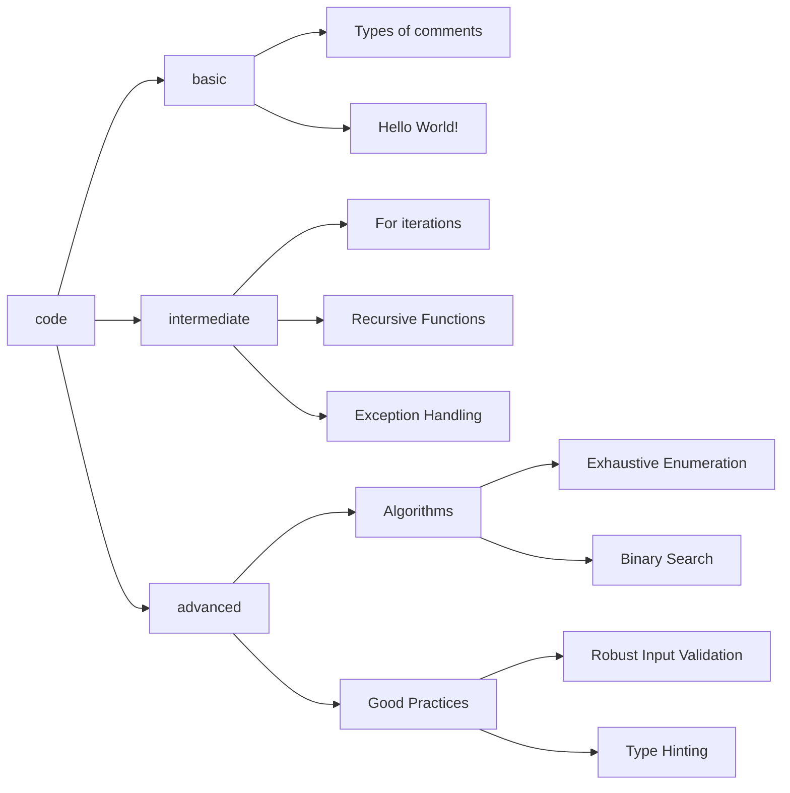

# 🐍 Learn Python by Examples

Learn Python through practical and commented examples.

## 👋 Welcome!

Welcome to the "Learn Python by Examples" repository! This project is designed to be a practical and accessible resource for anyone looking to learn or improve their Python skills. Here you will find a carefully curated collection of code examples, from the most basic concepts to more advanced topics, all with detailed comments to guide you through your learning journey.

We invite you to explore, experiment, and, of course, contribute. _Happy coding!_

## 🔍 Overview

This project is structured into three main difficulty levels: _basic_, _intermediate_, and _advanced_. Each example is self-contained and includes detailed documentation to facilitate understanding. The following diagram illustrates the main topics covered within the project.

For a more detailed overview, see the [Project Overview](docs/01_project_overview.md).

## ✨ Main Features

-   **📈 Pedagogical Progression**: Examples range from basic to advanced levels.

-   **📦 Self-contained**: Each example is independent and does not require external dependencies.

-   **💡 Detailed Comments**: Comments explain the code to facilitate understanding.

For a detailed breakdown of features and requirements, see the [Requirements](docs/02_requirements.md) and [Features](docs/03_features.md) documents.

## 🧑‍💻 Who is this project for?

While this repository is designed to be accessible, it is assumed that the user has a basic understanding of programming concepts from any language. To get the most out of these examples, it is recommended to be familiar with:

-   What variables and constants are.
-   Basic data types (integers, strings, booleans).
-   Common operators (arithmetic, comparison).
-   Basic use of a code editor or IDE (like Visual Studio Code).
-   Basic command line/console navigation.

## 🚀 Quick Start Guide

1. Clone or download the repository.

2. Open the example files in your preferred code editor.

3. Study the code and comments.

4. Experiment with the examples to see how changes affect the program's behavior.

For detailed instructions on setup, installation, and usage, refer to the [Setup and Installation Guide](docs/07_setup_and_installation.md) and the [Usage Guide](docs/08_usage_guide.md).

## 📝 Examples List

### Basic Examples 📗

-   [Types of comments in Python](https://github.com/seyerjo/learn-python-by-examples/blob/main/code/basic/sample_00_comments_types.py)

-   [Hello World in Python](https://github.com/seyerjo/learn-python-by-examples/blob/main/code/basic/sample_01_hello_world.py)

-   [Primitive data types in Python](https://github.com/seyerjo/learn-python-by-examples/blob/main/code/basic/sample_02_primitives_data_types.py)

-   [String Operations in Python](https://github.com/seyerjo/learn-python-by-examples/blob/main/code/basic/sample_03_strings_operations.py)

-   [Operators in Python](https://github.com/seyerjo/learn-python-by-examples/blob/main/code/basic/sample_04_operators.py)

-   [Getting User Input in Python](https://github.com/seyerjo/learn-python-by-examples/blob/main/code/basic/sample_05_inputs.py)

-   [Python Fundamentals: Naming, Keywords, and Dynamic Typing](https://github.com/seyerjo/learn-python-by-examples/blob/main/code/basic/sample_06_fundamentals.py)

-   [Flow control in Python](https://github.com/seyerjo/learn-python-by-examples/blob/main/code/basic/sample_07_flow_control.py)

-   [Code Reusability and the DRY Principle](https://github.com/seyerjo/learn-python-by-examples/blob/main/code/basic/sample_08_more_fundamentals.py)

-   [Escape character in Python strings](https://github.com/seyerjo/learn-python-by-examples/blob/main/code/basic/sample_09_escape_character_and_strings.py)

### Intermediate Examples 📙

-   [While Loops in Python](https://github.com/seyerjo/learn-python-by-examples/blob/main/code/intermediate/sample_10_while_iterations.py)

-   [Nested 'while' Loops in Python](https://github.com/seyerjo/learn-python-by-examples/blob/main/code/intermediate/sample_11_more_while_iterations.py)

-   [Advanced 'while' Loop control with 'break'](https://github.com/seyerjo/learn-python-by-examples/blob/main/code/intermediate/sample_12_additional_while_iterations.py) [ iterations](https://github.com/seyerjo/learn-python-by-examples/blob/main/code/intermediate/sample_12_additional_while_iterations.py)

-   ['for' Loops in Python](https://github.com/seyerjo/learn-python-by-examples/blob/main/code/intermediate/sample_13_for_iterations.py)

-   [More 'for' Loop Examples in Python](https://github.com/seyerjo/learn-python-by-examples/blob/main/code/intermediate/sample_14_more_for_iterations.py)

-   [Functions in Python](https://github.com/seyerjo/learn-python-by-examples/blob/main/code/intermediate/sample_15_functions.py)

-   [Recursive Functions in Python](https://github.com/seyerjo/learn-python-by-examples/blob/main/code/intermediate/sample_16_recursive_functions.py)

-   [Python's Recursion Limit and 'RecursionError'](https://github.com/seyerjo/learn-python-by-examples/blob/main/code/intermediate/sample_17_recursion_limit.py)

-   [Exception Handling: The 'try-except-else-finally' Block](https://github.com/seyerjo/learn-python-by-examples/blob/main/code/intermediate/sample_18_exception_handling.py)

### Advanced Examples 📕

-   [Exhaustive Enumeration (Guess and Check) Algorithm](https://github.com/seyerjo/learn-python-by-examples/blob/main/code/advanced/sample_19_exhaustive_listing_algorithm.py)

-   [Solution Approximation Algorithm](https://github.com/seyerjo/learn-python-by-examples/blob/main/code/advanced/sample_20_solution_approximation_algorithm.py)

-   [Binary Search for Solution Finding Algorithm](https://github.com/seyerjo/learn-python-by-examples/blob/main/code/advanced/sample_21_binary_search_algorithm.py)

-   [Robust and Reusable Input Validation](https://github.com/seyerjo/learn-python-by-examples/blob/main/code/advanced/sample_22_robust_input_validation.py)

-   [Type Hinting (PEP 484)](https://github.com/seyerjo/learn-python-by-examples/blob/main/code/advanced/sample_23_type_hinting.py)

## 📊 Difficulty Levels

The difficulty of each example is indicated by the following icons:

-   📗 **Basic**: Introduces the basics of the language and its syntax.

-   📙 **Intermediate**: Covers more advanced topics and concepts.

-   📕 **Advanced**: Demonstrates more complex and advanced techniques.

## 🔄 Project Status

This project is actively maintained and updated periodically. New examples and modifications to existing ones are added regularly to enhance the learning experience.

For more details on the project's status and development notes, refer to the documentation.

## 💻 Code Quality

The code in this repository is formatted using autopepe8 and adheres to the guidelines set by Pylint, ensuring high code quality and readability.

For detailed coding standards, see the [Code Style Guide](docs/09_code_style_guide.md).

## 👋 Contributing

We welcome contributions to the "Learn Python by Examples" project! Whether you want to report a bug, suggest an improvement, or contribute code and documentation, your help is valuable.

Please read our [Contribution Guidelines](./CONTRIBUTION_GUIDELINES.md) and [Code of Conduct](./CODE_OF_CONDUCT.md) before contributing.

## 📜 License

All examples in this repository are under the [MIT license](./LICENSE), allowing for use in any project, including commercial ones.

## 📖 Full Documentation

For a complete and structured view of all project documentation, including vision, requirements, architecture, and development guidelines, please visit our main documentation index:

-   [**📚 Full Documentation Index**](./docs/00_documentation_index.md)

## 📚 Additional Resources

To complement your learning, here are some valuable official and unofficial resources:

### Official Resources

-   [Beginner's Guide to Python](https://wiki.python.org/moin/BeginnersGuide)
-   [Python for Non-Programmers](https://wiki.python.org/moin/BeginnersGuide/NonProgrammers)
-   [Python for Programmers](https://wiki.python.org/moin/BeginnersGuide/Programmers)
-   [Downloading Python](https://wiki.python.org/moin/BeginnersGuide/Download)
-   [Using Python on Windows](https://docs.python.org/3/faq/windows.html)
-   [Using Python on Linux](https://docs.python.org/3/using/unix.html)
-   [Using Python on macOS](https://docs.python.org/3/using/mac.html)

### Unofficial Resources

-   [Python Tutorial](https://python.land/python-tutorial)
-   [Codédex](https://www.codedex.io/python)
-   [Getting Started with Python in VS Code](https://code.visualstudio.com/docs/python/python-tutorial)
