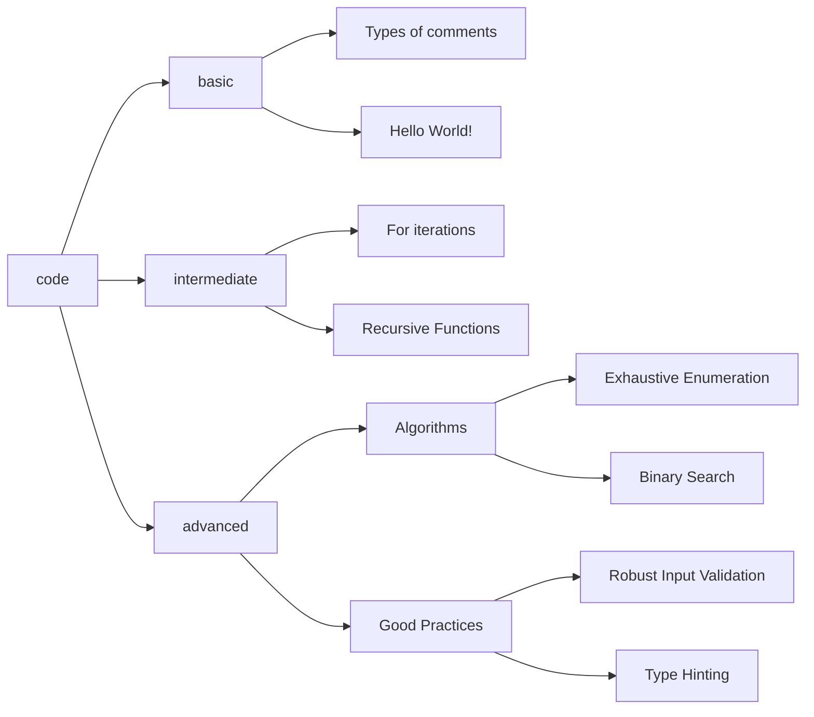

# 🐍 Learn Python by Examples

Learn Python through practical and commented examples.

 

## 👋 Welcome!

Welcome to the "Learn Python by Examples" repository! This project is designed to be a practical and accessible resource for anyone looking to learn or improve their Python skills. Here you will find a carefully curated collection of code examples, from the most basic concepts to more advanced topics, all with detailed comments to guide you through your learning journey.

We invite you to explore, experiment, and, of course, contribute. _Happy coding!_

## 🔍 Overview

This project is structured into three main difficulty levels: _basic_, _intermediate_, and _advanced_. Each example is self-contained and includes detailed documentation to facilitate understanding. The following diagram illustrates the main topics covered within the project.

For a more detailed overview, see the [Project Overview](docs/01_project_overview.md).

## ✨ Main Features

- **📈 Pedagogical Progression**: Examples range from basic to advanced levels.

- **📦 Self-contained**: Each example is independent and does not require external dependencies.

- **💡 Detailed Comments**: Comments explain the code to facilitate understanding.

For a detailed breakdown of features and requirements, see the [Requirements](docs/02_requirements.md) and [Features](docs/03_features.md) documents.

## 🚀 Quick Start Guide

1. Clone or download the repository.

2. Open the example files in your preferred code editor.

3. Study the code and comments.

4. Experiment with the examples to see how changes affect the program's behavior.

For detailed instructions on setup, installation, and usage, refer to the [Setup and Installation Guide](docs/07_setup_and_installation.md) and the [Usage Guide](docs/08_usage_guide.md).

## 📝 Examples List

### Basic Examples 📗

- [Types of comments](https://github.com/seyerjo/learn-python-by-examples/blob/main/code/basic/sample_00_comments_types.py)

- [Hello World!](https://github.com/seyerjo/learn-python-by-examples/blob/main/code/basic/sample_01_hello_world.py)

- [Primitive data types in Python](https://github.com/seyerjo/learn-python-by-examples/blob/main/code/basic/sample_02_primitives_data_types.py)

- [Character strings operations](https://github.com/seyerjo/learn-python-by-examples/blob/main/code/basic/sample_03_strings_operations.py)

- [Operators](https://github.com/seyerjo/learn-python-by-examples/blob/main/code/basic/sample_04_operators.py)

- [Console user inputs](https://github.com/seyerjo/learn-python-by-examples/blob/main/code/basic/sample_05_inputs.py)

- [User inputs, global variables and character strings operations](https://github.com/seyerjo/learn-python-by-examples/blob/main/code/basic/sample_06_inputs_variables_and_strings.py)

- [Flow control: 'if-else' statement](https://github.com/seyerjo/learn-python-by-examples/blob/main/code/basic/sample_07_flow_control.py)

- [More user inputs, global variables and character strings operations](https://github.com/seyerjo/learn-python-by-examples/blob/main/code/basic/sample_08_more_inputs_variables_and_strings.py)

- [Escape character and strings](https://github.com/seyerjo/learn-python-by-examples/blob/main/code/basic/sample_09_escape_character_and_strings.py)

### Intermediate Examples 📙

- ['While' iterations](https://github.com/seyerjo/learn-python-by-examples/blob/main/code/intermediate/sample_10_while_iterations.py)

- [More 'While' iterations](https://github.com/seyerjo/learn-python-by-examples/blob/main/code/intermediate/sample_11_more_while_iterations.py)

- [Additional 'While' ](https://github.com/seyerjo/learn-python-by-examples/blob/main/code/intermediate/sample_12_additional_while_iterations.py) [ iterations](https://github.com/seyerjo/learn-python-by-examples/blob/main/code/intermediate/sample_12_additional_while_iterations.py)

- ['For' iterations](https://github.com/seyerjo/learn-python-by-examples/blob/main/code/intermediate/sample_13_for_iterations.py)

- [More 'For' iterations](https://github.com/seyerjo/learn-python-by-examples/blob/main/code/intermediate/sample_14_more_for_iterations.py)

- [Functions](https://github.com/seyerjo/learn-python-by-examples/blob/main/code/intermediate/sample_15_functions.py)

- [Recursive Functions](https://github.com/seyerjo/learn-python-by-examples/blob/main/code/intermediate/sample_16_recursive_functions.py)

- [Recursion Limit](https://github.com/seyerjo/learn-python-by-examples/blob/main/code/intermediate/sample_17_recursion_limit.py)

### Advanced Examples 📕

- [Exhaustive Listing Algorithm](https://github.com/seyerjo/learn-python-by-examples/blob/main/code/advanced/sample_18_exhaustive_listing_algorithm.py)

- [Solution Approximation Algorithm](https://github.com/seyerjo/learn-python-by-examples/blob/main/code/advanced/sample_19_solution_approximation_algorithm.py)

- [Binary Search Algorithm](https://github.com/seyerjo/learn-python-by-examples/blob/main/code/advanced/sample_20_binary_search_algorithm.py)

- [Robust Input Validation](https://github.com/seyerjo/learn-python-by-examples/blob/main/code/advanced/sample_21_robust_input_validation.py)

- [Type Hinting (PEP 484)](https://github.com/seyerjo/learn-python-by-examples/blob/main/code/advanced/sample_22_type_hinting.py)

## 📊 Difficulty Levels

The difficulty of each example is indicated by the following icons:

- 📗 **Basic**: Introduces the basics of the language and its syntax.

- 📙 **Intermediate**: Covers more advanced topics and concepts.

- 📕 **Advanced**: Demonstrates more complex and advanced techniques.

## 🔄 Project Status

This project is actively maintained and updated periodically. New examples and modifications to existing ones are added regularly to enhance the learning experience.

For more details on the project's status and development notes, refer to the documentation.

## 💻 Code Quality

The code in this repository is formatted using autopepe8 and adheres to the guidelines set by Pylint, ensuring high code quality and readability.

For detailed coding standards, see the [Code Style Guide](docs/09_code_style_guide.md).

## 👋 Contributing

We welcome contributions to the "Learn Python by Examples" project! Whether you want to report a bug, suggest an improvement, or contribute code and documentation, your help is valuable.

Please read our [Contribution Guidelines](./CONTRIBUTION_GUIDELINES.md) and [Code of Conduct](./CODE_OF_CONDUCT.md) before contributing.

## 📜 License

All examples in this repository are under the [MIT license](./LICENSE), allowing for use in any project, including commercial ones.

## 📖 Full Documentation

For a complete and structured view of all project documentation, including vision, requirements, architecture, and development guidelines, please visit our main documentation index:

- [**📚 Full Documentation Index**](./docs/00_documentation_index.md)
