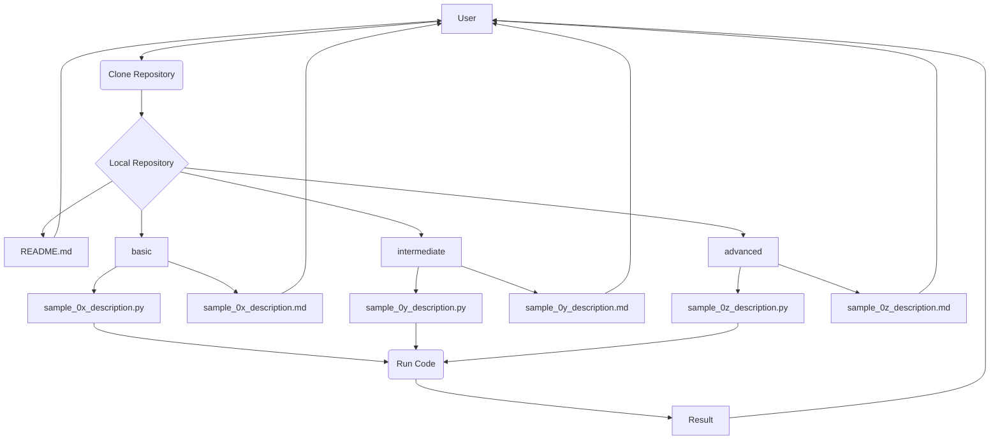

# Project Structure: Learn Python by Examples

This document describes the initial proposed structure for the "Learn Python by Examples" project, detailing its main components and organization.

## Proposed Architecture

The project architecture is simple and based on a file and folder structure within a version control repository (Git). It is not a complex software architecture with multiple services or components running simultaneously, but rather a logical organization of educational content.

## Main Components

The main components of the project are the files and directories that make up the repository:

- **`/` (Repository Root):** Contains general project configuration files and the main `README.md`.

- **`README.md`:** Main entry file that provides an overview of the project, how to navigate it, requirements and how to get started.

- **`/docs`:** Directory that will contain the general project documentation (such as this file, `project_overview.md`, `requirements.md`, etc.).

- **`/basic`:** Directory intended to contain code examples and their documentation for the **Basic** difficulty level.

- **`/intermediate`:** Directory intended to contain code examples and their documentation for the **Intermediate** difficulty level.

- **`/advanced`:** Directory intended to contain code examples and their documentation for the **Advanced** difficulty level.

- **`sample_0x_description.py` (within level folders):** Files containing Python code for a specific example. Filenames will follow the pattern `sample_` followed by a sequential two-digit number (`00`, `01`, `02`, ...) and a brief description in lowercase separated by underscores.

- **`sample_0x_description.md` (within level folders):** Files containing documentation associated with the corresponding `.py` file. The filename will match the `.py` file, only changing the extension to `.md`.

## Communication Between Components

Since the project is a static collection of files, there is no runtime communication between components in the traditional application sense. The "interaction" occurs at the user level by navigating through the file system and reading documents and code.

## Database Structure

N/A. This project does not require a database.

## Data Flow (Typical Usage Example)

The data flow is conceptual and describes how a typical user would interact with the repository:

1. The user clones the repository from GitHub.
2. The user opens the `README.md` file in the root to get an overview and instructions.
3. The user navigates to one of the difficulty level directories (e.g., `/basic`).
4. Within the level directory, the user selects an example (`sample_0x_description.py`) and opens its associated documentation (`sample_0x_description.md`).
5. The user reads the documentation to understand the purpose and execution of the example.
6. The user runs the `sample_0x_description.py` file in their local Python environment.

_Simple diagram illustrating the user's conceptual navigation through the repository, using the filename pattern._

## Technology Stack

The project is primarily based on:

- **Python**: The programming language used for code examples.
- **Markdown**: The markup language used for documentation.
- **Git**: The version control system for managing the repository.
- **GitHub**: The repository hosting platform.
