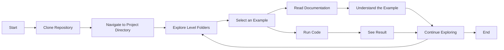

# Usage Guide: Learn Python by Examples

This document provides a step-by-step guide on how to use the "Learn Python by Examples" project to explore and run the Python code examples.

## Introduction

"Learn Python by Examples" is a code repository designed to help you learn Python through practical examples. This guide will show you how to navigate the repository, find examples of interest, and run them in your own environment.

## Prerequisites

Before you begin, make sure you have completed the initial setup steps described in the [Setup and Installation Guide](setup_and_installation.md) document. You will need to have Python and Git installed, and have cloned the project repository to your local machine.

## Typical Usage Flow

The typical usage flow of the project involves cloning the repository (a one-time action), navigating through the difficulty level folders, selecting an example, reading its documentation, and running the Python code.



_Flowchart illustrating the typical usage of the project._

## Exploring Examples

Examples are organized in folders according to their difficulty level: `/code/basic`, `/code/intermediate`, and `/code/advanced`.

1. Open your terminal or file explorer and navigate to the directory where you cloned the `learn-python-by-examples` repository.

2. Enter the folder for the difficulty level you are interested in (e.g., `cd /code/basic`).

3. Inside each level folder, examples are named following the pattern `sample_0x_description.py` and their associated documentation `sample_0x_description.md`. Explore the filenames to find examples that look interesting to you.

## Running Examples

Each `.py` file is a Python script that you can run directly if you have Python installed.

1. Open your terminal or command prompt.

2. Navigate to the folder containing the `.py` file of the example you want to run.

3. Run the script using the Python interpreter:

    ```bash
    python example_name.py
    # or, if you use python3
    python3 example_name.py

    ```

    (Replace `example_name.py` with the actual filename).

## Reading the Documentation

Each code example has a corresponding `.md` file with the same name (except for the extension) that provides a detailed explanation.

1. Open the `.md` file corresponding to the example you are viewing in your text editor or a Markdown viewer.

2. Read the documentation to understand:
    - The purpose of the example.
    - The Python concepts it illustrates.
    - How the code works step-by-step.
    - The expected output.
    - Possible variations or points to consider.

## Expected Output

When running an example script, the expected output is that the code executes without errors (unless the specific example demonstrates error handling) and produces the output described in its associated documentation. This could be text printed to the console, the creation of a file, or any other action the code is designed to perform.

## Basic Troubleshooting

If you encounter issues when running an example:

-   **Python not found error:** Make sure Python is correctly installed and configured in your PATH. Refer to the [Setup and Installation Guide](setup_and_installation.md).
-   **Git not found error:** Make sure Git is correctly installed and configured in your PATH. Refer to the [Setup and Installation Guide](setup_and_installation.md).
-   **"File not found" error:** Verify that you are in the correct directory in your terminal and that the `.py` filename you are trying to run is correct.
-   **Syntax or execution errors in the code:** Carefully review the code and compare it with the documentation. There might be a typo or you might need to install a dependency (although initial examples should avoid this). If you believe there is an error in the example itself, consider reporting it through the contribution process.
-   **Output is not as expected:** Read the example's documentation again to ensure you have understood its purpose and how it should work.

If you encounter a problem you cannot solve, you can search the [GitHub Issues](https://github.com/seyerjo/learn-python-by-examples/issues) to see if someone else has had the same problem, or open a new issue to ask for help.
